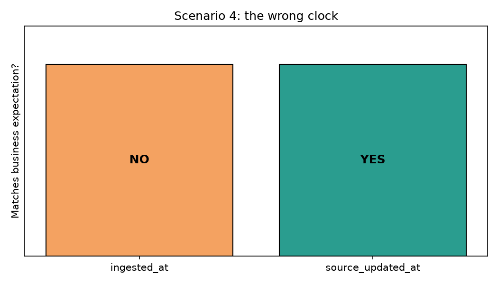
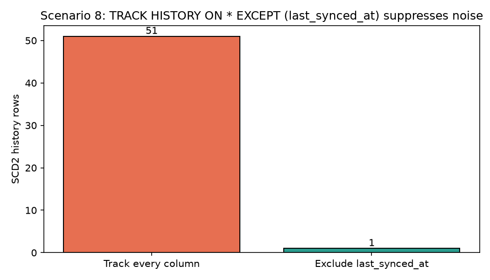
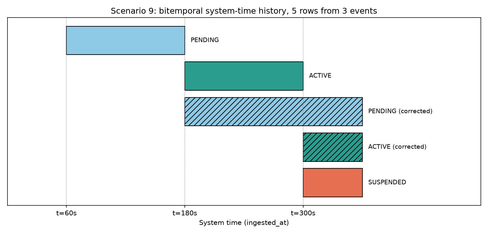
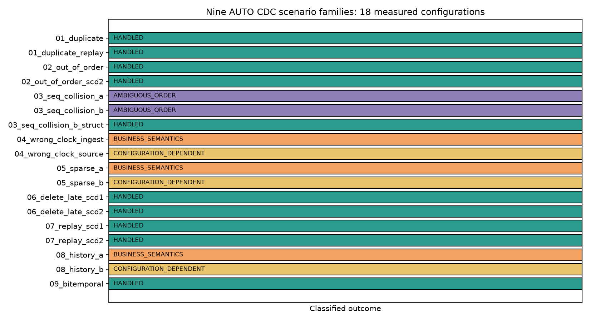

# I tried to break Lakeflow AUTO CDC

A reproducible report of feeding nine hostile CDC streams into a Lakeflow Declarative Pipelines `AUTO CDC` flow and recording what it does.

> **TL;DR.** `AUTO CDC` applies the ordering and update semantics you configure. Scenario 4 shows the main risk: `SEQUENCE BY` encodes the domain's definition of "newer." An ingestion timestamp can produce a green pipeline with the wrong business state. `IGNORE NULL UPDATES`, `TRACK HISTORY ON * EXCEPT`, and composite `SEQUENCE BY` address the other tested failure modes. Across nine scenario families and eighteen configurations, the results are **ten** `HANDLED`, **three** `CONFIGURATION_DEPENDENT`, **three** `BUSINESS_SEMANTICS`, and **two** `AMBIGUOUS_ORDER`.

---

## Why I built this

I have debugged CDC bugs caused by clocks that disagreed, replays that arrived days late, and sparse updates that nulled columns. I built a controlled experiment around those failures. The verifier encodes each expected state and captures the measured target rows.

The article maps the boundary of `AUTO CDC`: its guarantees, its undefined inputs, and the configurations required beyond the defaults. AUTO CDC has a small, well-defined contract. Sources that violate it need an upstream fix or a different tool.

Every claim below traces to either:

1. A measured row in `results/normalized/summary_matrix.md` (from `results/raw/scenario_results.json`).
2. A passage in `docs/sources.md` from the official Databricks documentation.

The pipeline and generator code is in [`src/pipeline/pipeline.py`](../src/pipeline/pipeline.py) and [`src/generators/dispatch.py`](../src/generators/dispatch.py). The [reproduction guide](../docs/reproduction.md) and [claim-by-claim evidence ledger](fact-check.md) carry the operational detail. You can rerun the whole experiment with `make setup && make test && make results`.

---

## How the experiment is wired

### Topology

```
generator (Python)        materializer (Databricks SDK)
    │                              │
    ▼                              ▼
  Delta source table    ──►   @dp.view (readStream)
  (workspace.auto_cdc_torture_test.sNN_xxx_src)
                                 │
                                 ▼
                          AUTO CDC flow
                                 │
                                 ▼
                   workspace.auto_cdc_torture_test.sNN_xxx_tgt
```

- The materializer drops and re-creates the source tables for the baseline, then appends the withheld late and replay rows for update 2.
- Each source is wrapped in a `@dp.view` that calls `readStream.table(...)`. AUTO CDC requires a streaming source; `read` (batch) is rejected.
- One or more AUTO CDC flows per source declare the target schema, keys, `SEQUENCE BY` column, delete rule, and storage type.

### What I assert

For each scenario, three things are recorded:

| Field | Meaning |
|---|---|
| `ordering_complete` | Does the configured `SEQUENCE BY` fully order rows with different business states? |
| `business_assertion_passed`   | Did the resulting target match the *domain*'s expectation? |
| `target_rows` / `history_rows` | The measured counts in the target table. |

The classification in `summary_matrix.md` combines ordering completeness, business correctness, and whether the result requires a non-default option:

- `HANDLED`: ordering is complete and AUTO CDC produces the expected state.
- `CONFIGURATION_DEPENDENT`: business state matches with a non-default configuration.
- `BUSINESS_SEMANTICS`: ordering is complete and the pipeline is green, but the chosen semantics produce the wrong business state.
- `AMBIGUOUS_ORDER`: two different business states share the same configured sequence value. The run records the observed state but does not treat it as portable behavior.

---

## Scenario 1: exact duplicate

A single CDC event is delivered twice. Same key, same `source_sequence`, same payload.

```
source_sequence: 10
status: ACTIVE
```

The documentation does not define conflict resolution for equal `SEQUENCE BY` values. In this test the duplicate payload is identical, so either copy produces the same current state.

Measured: 1 row, `status=ACTIVE`. Pipeline green. **HANDLED.**

The replay variant delivers the second copy after the baseline update, then runs the pipeline again. Its target remains byte-for-byte equal to the baseline target. This proves stable visible state for this identical replay; it does not establish transactional deduplication.

---

## Scenario 2: out-of-order delivery

A two-event CDC stream crosses two pipeline updates in reverse business order:

```
Logical:   seq=10 PENDING,  then seq=12 ACTIVE.
Update 1:  seq=12 ACTIVE.
Update 2:  seq=10 PENDING arrives late.
```

Documented behaviour: late events with smaller `SEQUENCE BY` values are dropped, because per-key max is strictly monotonic. Final state is the most recent in-sequence value.

Measured (SCD1): 1 row, `status=ACTIVE`. **HANDLED.**

Measured (SCD2 with `TRACK HISTORY ON * EXCEPT (last_synced_at)`): 2 history rows: `PENDING@10` closed at `__END_AT=12`, `ACTIVE@12` current. **HANDLED.**

The saved baseline proves the difference. SCD1 remains unchanged after update 2. SCD2 changes from one row to two and incorporates the late event as a closed version.

---

## Scenario 3: sequence collision

Same key, same `source_sequence`, *different business state*.

### 3A: no tie-breaker

```
seq=10  status=ACTIVE
seq=10  status=SUSPENDED        (same source_sequence, different state)
```

The configured order is incomplete. Databricks documents `SEQUENCE BY` as the logical order of CDC events and recommends a `STRUCT` when one field cannot break ties. It does not document which payload wins when two different states share the same configured value.

Measured: 1 row, `status=SUSPENDED` in this run. Classification: **AMBIGUOUS_ORDER.** The observation does not identify a portable tie-resolution rule.

### 3B: legitimate source-side tie-breaker

```
seq=10  txn=1   status=ACTIVE
seq=10  txn=2   status=SUSPENDED
```

`source_sequence` is intentionally held constant. The source has a separate `transaction_sequence` column that gives a *real* ordering. AUTO CDC by itself has no way to know about it.

Measured: 1 row, `status=SUSPENDED`. The configured `SEQUENCE BY source_sequence` still ignores `transaction_sequence`, so the order remains incomplete. Classification: **AMBIGUOUS_ORDER.** The composite configuration below uses the available tie-breaker.

### 3B-struct: composite `SEQUENCE BY` via `STRUCT`

Same rows as 3B, but `SEQUENCE BY` is `F.struct(F.col("source_updated_at"), F.col("transaction_sequence"))`. The composite key gives AUTO CDC the tie-breaker.

Measured: 1 row, `status=SUSPENDED`, deterministically. **HANDLED.**

This is the documented way to encode a source-side tie-breaker. Use a composite when one column lacks the required resolution.

Databricks documents `STRUCT(timestamp_col, id_col)` for composite sequencing: it orders by the first field and uses later fields to break ties.

---

## Scenario 4: the wrong clock

Scenario 4 motivated the experiment.

Two source events:

```
10:00 source time   ACTIVE
10:05 source time   SUSPENDED
```

Their recorded ingestion timestamps reverse the business order:

```
10:05 has ingested_at=10:06
10:00 has ingested_at=10:10
```

The *business* definition of "newest" is the source-event time. The *default ingestion* definition of "newest" is `ingested_at`. AUTO CDC is told to `SEQUENCE BY` either of these and the answers differ.

### 4-ingest (SEQUENCE BY ingested_at)

Pipeline picks 10:10 as the latest event because that is the most recent `ingested_at`. Final state: `ACTIVE`. Pipeline green. Business expectation does not match. Classified as `BUSINESS_SEMANTICS`.

### 4-source (SEQUENCE BY source_updated_at)

Pipeline picks 10:05 as the latest event. Final state: `SUSPENDED`. Pipeline green. Business expectation matches. Classified as `CONFIGURATION_DEPENDENT`.

> Out-of-order handling cannot choose the authoritative clock. If the business treats `source_updated_at` as the definition of "newer," use it in `SEQUENCE BY`. Ingestion time represents arrival order, which diverges from source time during batching, retries, and backfills.



The two configurations use the same flow, data, and target schema. Changing only `SEQUENCE BY` changes the answer from wrong to right.

---

## Scenario 5: sparse update / NULL semantics

A `customer` has `email='x@example.com'`. The next CDC event updates `city='Istanbul'` and *nulls out* `email`. There are two reasonable interpretations of "the source set `email = NULL`":

1. `email` is now `NULL` (the source told us the new value of this column is "no value").
2. `email` is unchanged (the source did not include the field; "null" means "absent").

### 5A: default

`email` is set to `NULL`. Final state: `email=NULL`, `city='Istanbul'`. The pipeline is green, while the scenario's business rule expects interpretation (2). Classification: `BUSINESS_SEMANTICS`.

### 5B: `IGNORE NULL UPDATES`

`email` is *kept* as `x@example.com`; `city` is updated to `'Istanbul'`. **HANDLED.** This is the documented knob for the (2) interpretation.

Databricks documents that `IGNORE NULL UPDATES` retains an existing target value when the corresponding incoming value is `NULL`.

Without this option, AUTO CDC applies the NULL without a log line, exception, or metric. Scenario 5A demonstrates the result. Use `IGNORE NULL UPDATES` when NULL means "absent"; leave it off when NULL means "set to NULL."

---

## Scenario 6: delete, then a late older event

```
seq=17   ACTIVE
seq=20   DELETE
seq=18   SUSPENDED     (arrives last)
```

The first pipeline update processes `seq=17` and the delete at `seq=20`. The second update appends `seq=18`.

### 6-scd1 (SCD1)

Per-key max on `source_sequence`: the DELETE at `seq=20` wins, the late `seq=18` event is dropped. Final target: empty. **HANDLED.** The late event is gone, but the DELETE is the most recent CDC, and that's what AUTO CDC writes.

### 6-scd2 (SCD2 with `TRACK HISTORY ON * EXCEPT`)

Late `seq=18` *is* processed because per-key max sees it as a legitimate update between 17 and 20. History records: `ACTIVE@17` → `SUSPENDED@18` → `DELETE@20`. The DELETE closes the active row at `__END_AT=20`. **HANDLED.**

This is the asymmetry I called out in scenario 2: late events are dropped in SCD1 and processed in SCD2. If you replay, you'll see different histories depending on storage type.

---

## Scenario 7: full replay

The first update processes a complete customer lifecycle:

```
seq=10  PENDING
seq=20  ACTIVE   (Antalya)
seq=30  ACTIVE   (Izmir)
seq=40  SUSPENDED (Ankara)
seq=50  DELETE
```

### 7-scd1

The second update appends the same five rows again. The SCD1 target is empty before and after replay. **HANDLED.** The visible current state is unchanged.

### 7-scd2

The SCD2 target contains four rows before replay: `PENDING[10,20) → ACTIVE(Antalya)[20,30) → ACTIVE(Izmir)[30,40) → SUSPENDED(Ankara)[40,50)`. It contains the same columns and rows after replay. **HANDLED.**

The replay check compares different things by storage type. SCD1 compares current state. SCD2 compares the complete visible history.

---

## Scenario 8: SCD2 history noise

A customer gets 50 updates where the only thing that changes is `last_synced_at` (an operational field that updates on every read of the source). All other business fields stay constant.

### 8A: track every column

A default SCD2 flow sees `last_synced_at` change and creates 51 history rows. The experiment's business rule wants history only for business-field changes. **BUSINESS_SEMANTICS.**

### 8B: `TRACK HISTORY ON * EXCEPT (last_synced_at)`

The same source, but `last_synced_at` is excluded from the columns that trigger a new history row. Result: 1 history row (the initial insert). All 50 noise updates collapse onto it. **CONFIGURATION_DEPENDENT.**

Databricks documents `TRACK HISTORY ON * EXCEPT` for excluding columns from history tracking.

Many CDC sources update operational timestamps on each sync. Default SCD2 tracking then records those changes as new versions. Decide which columns carry business history before deploying the flow.



---

## Scenario 9: bitemporal (Beta)

Three source events with distinct business times and distinct system times. The flow uses `system_sequence_by="ingested_at"` and `stored_as_scd_type="bitemporal"`.

The target table carries *two* pairs of timestamps:

- `__START_AT` / `__END_AT`: business time, derived from `SEQUENCE BY` (`source_updated_at`).
- `__SYSTEM_START_AT` / `__SYSTEM_END_AT`: system time, derived from `SYSTEM SEQUENCE BY` (`ingested_at`).

Measured: 5 history rows, both pairs populated. **HANDLED.**



The target has five rows because later events revise what the system knows about earlier valid-time intervals. With three events arriving at system times 60s, 180s, and 300s:

- Event 1 writes a PENDING belief with an open valid-time interval.
- Event 2 closes that belief in system time, writes a corrected PENDING interval ending at business time 120s, and adds ACTIVE.
- Event 3 closes the original ACTIVE belief in system time, writes a corrected ACTIVE interval ending at business time 240s, and adds SUSPENDED.

The target preserves each original belief with a closed system-time interval and writes the corrected belief as a new open row. `target_state.json` contains all five measured rows; the figure reads those rows directly.

Bitemporal is the only context where `SYSTEM SEQUENCE BY` is honored. It is documented as Beta. The operational win over plain SCD2 is the ability to record "this is what we knew *as of* time X" even after the row has been corrected. If your source has a clean valid-time that differs from ingest time and you need to support late corrections without losing history, bitemporal is the right tool.

---

## Summary matrix

```
Scenario                          Pipeline  Correct state  Ordering   Classification
01_duplicate                      GREEN     YES            COMPLETE   HANDLED
01_duplicate_replay               GREEN     YES            COMPLETE   HANDLED
02_out_of_order                   GREEN     YES            COMPLETE   HANDLED
02_out_of_order_scd2              GREEN     YES            COMPLETE   HANDLED
03_seq_collision_a                GREEN     NO             AMBIGUOUS  AMBIGUOUS_ORDER
03_seq_collision_b                GREEN     YES            AMBIGUOUS  AMBIGUOUS_ORDER
03_seq_collision_b_struct         GREEN     YES            COMPLETE   HANDLED
04_wrong_clock_ingest             GREEN     NO             COMPLETE   BUSINESS_SEMANTICS
04_wrong_clock_source             GREEN     YES            COMPLETE   CONFIGURATION_DEPENDENT
05_sparse_a                       GREEN     NO             COMPLETE   BUSINESS_SEMANTICS
05_sparse_b                       GREEN     YES            COMPLETE   CONFIGURATION_DEPENDENT
06_delete_late_scd1               GREEN     YES            COMPLETE   HANDLED
06_delete_late_scd2               GREEN     YES            COMPLETE   HANDLED
07_replay_scd1                    GREEN     YES            COMPLETE   HANDLED
07_replay_scd2                    GREEN     YES            COMPLETE   HANDLED
08_history_a                      GREEN     NO             COMPLETE   BUSINESS_SEMANTICS
08_history_b                      GREEN     YES            COMPLETE   CONFIGURATION_DEPENDENT
09_bitemporal                     GREEN     YES            COMPLETE   HANDLED
```



The machine-readable matrix is in [`results/normalized/summary_matrix.json`](../results/normalized/summary_matrix.json), with the captured target rows in [`results/raw/target_state.json`](../results/raw/target_state.json).

---

## AUTO CDC guarantees and boundaries

Reading across the scenarios, here is the contract as I now understand it, in three concentric layers.

### Guaranteed, by documentation

- Per-key max on the `SEQUENCE BY` column (single column, or `STRUCT` / tuple for composite).
- Drops late events with strictly smaller `SEQUENCE BY` values.
- `IGNORE NULL UPDATES` keeps existing values when an UPDATE event nulls them out.
- `APPLY AS DELETE WHEN` translates flagged events into tombstones.
- `TRACK HISTORY ON * EXCEPT (col_list)` lets you opt columns out of triggering new SCD2 history rows.
- `SYSTEM SEQUENCE BY` is supported in bitemporal storage (Beta).

### Observed in this two-phase run

The documentation does not promise these exact target snapshots. The checked-in before/after evidence supports them for this run.

- The identical replay in scenario 1 leaves visible SCD1 state unchanged.
- The late rows in scenarios 2 and 6 leave SCD1 unchanged and add closed versions to SCD2.
- Replaying scenario 7's five-event lifecycle leaves both the SCD1 target and the complete SCD2 target unchanged.

### Rules AUTO CDC cannot choose

This list is a summary; the scenarios above are the measurements.

- Order in the business's sense of "newest". The pipeline respects the `SEQUENCE BY` column you give it. If the column doesn't match the business's notion of time, you get a green pipeline with wrong state. (Scenario 4.)
- A business order for different states that share one configured `SEQUENCE BY` value. The documentation tells you how to add a composite tie-breaker, not which tied payload wins. (Scenario 3.)
- Survival of a sparse NULL update. Default is "set to NULL". If you want "absent", opt in. (Scenario 5.)
- SCD2 history that excludes operational noise. Default is "every column change creates a row". If you want "business-significant changes only", opt in. (Scenario 8.)

---

## Where the boundary is

AUTO CDC fits three source-data conditions:

1. **The configured sequence fully orders business states.** NULL has a defined meaning, and one column or composite defines order. AUTO CDC can then produce a stable SCD1 or SCD2 target without application code.

2. **Configuration can express the missing rule.** Composite `SEQUENCE BY`, `IGNORE NULL UPDATES`, and `TRACK HISTORY ON * EXCEPT` cover the tested variations.

3. **The source has no expressible order.** Multiple writers can produce the same sequence value without a tie-breaker, or the domain requires custom delete and late-update merging. Enforce ordering upstream or use an application-controlled stream processor such as Spark Structured Streaming or Flink.

The nine scenarios cover each condition with measured source and target states.

## What I check first, on a new AUTO CDC stream

For a new CDC stream, I check four things:

1. **Pick `SEQUENCE BY` from the business definition of "newer."** If source time carries that meaning, use it. Ingestion time records arrival and may diverge during batching, retries, or backfills. This is scenario 4.
2. **Check for duplicate sequence values per key.** If two events with the same `customer_id` can arrive with the same `source_sequence`, you have a 3A situation. Fix it upstream, or expose a tie-breaker as a composite `STRUCT` (3B-struct).
3. **Decide what NULL means.** If your source can emit a sparse row where a column is "absent" (not "set to NULL"), turn on `IGNORE NULL UPDATES`. Default behaviour silently overwrites with NULL (scenario 5A).
4. **Decide whether you want SCD1 or SCD2 before you write the flow.** They handle late events (scenario 2) and full replays (scenario 7) differently. For SCD2, list operational timestamps in `TRACK HISTORY ON * EXCEPT` to prevent history noise (scenario 8).

Use bitemporal storage when source "as-of" time differs from ingest time and you need both histories. Use a streaming job when the domain requires custom merging of deletes and late updates.

---

## What I did not test

- I did not stress test at volume. The dataset is tiny. The runtime characteristics of AUTO CDC at scale (backpressure, checkpointing, large `__END_AT` joins) are out of scope.
- I did not test *partial* schema evolution. The schemas here are stable across all events.
- I did not test multi-stream scenarios (e.g. a customer table joined to an orders table that arrives late). AUTO CDC is per-flow, and the join semantics depend on the surrounding pipeline.
- I did not test the Beta `bitemporal` mode under load. It is documented as Beta for a reason.

The repository issue tracker is the place to request partial schema evolution, multi-stream joins, or large-scale throughput tests.

---

## Reproduction

Everything in this article is reproducible from a fresh clone:

```bash
databricks auth login --host https://<your-workspace>.cloud.databricks.com --profile DEFAULT
git clone https://github.com/ivanvyd/lakeflow-auto-cdc-torture-test.git
cd lakeflow-auto-cdc-torture-test
make setup      # validate and deploy the bundle
make test       # full refresh, capture baseline, append late rows, incremental update, verify
make results    # regenerate the summary matrix and figures
```

The full reproduction guide is in `docs/reproduction.md`. Sources for every claim are in `docs/sources.md`. A fact-check that traces each article paragraph to its source row is in `article/fact-check.md`.

## Verification (last full end-to-end run)

The latest evidence uses pipeline `1ff99f04-078f-4c91-97e3-f06ad7614f7f`. Full-refresh update `76337b92-46fd-445d-b929-7a85aa038471` established the baseline. Incremental update `d14e5ff1-b840-4e14-affd-902ec98f9fdf` processed the late and replay rows. Both completed.

`capture_baseline.py` saved every target after the full refresh. `write_results.py` captured them again after the incremental update. Sixteen targets remained identical; only the two expected SCD2 histories changed. The verifier then checked row counts and scenario-specific state predicates for all 18 targets. Scenario 9's predicate matches all five valid-time and system-time intervals, not only the count. The resulting classification is 10 `HANDLED`, 3 `CONFIGURATION_DEPENDENT`, 3 `BUSINESS_SEMANTICS`, and 2 `AMBIGUOUS_ORDER`.

The checked-in evidence includes `baseline_target_state.json`, `target_state.json`, the 18-row summary, and four figures. The bitemporal figure reads the captured rows directly. The release run cloned the public `release/article-evidence` branch at execution commit `01d53b4`, installed its pinned dependencies in a new virtual environment, and repeated `setup`, `test`, and `results` before merge.
